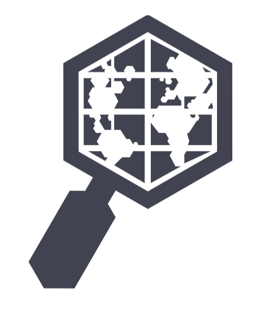

<!-- README.md is generated from README.Rmd. Please edit that file -->

```{r, include = FALSE}
knitr::opts_chunk$set(
  collapse = TRUE,
  comment = "#>",
  fig.path = "man/figures/README-",
  out.width = "40%",
  eval = TRUE
)

library(AOI)
```

# AOI 

<!-- badges: start -->
[](https://zenodo.org/badge/latestdoi/158620263)
[](https://github.com/mikejohnson51/AOI/actions/workflows/R-CMD-check.yaml)
[](#)
[](https://choosealicense.com/licenses/mit/)
[](https://codecov.io/github/mikejohnson51/AOI)
<!-- badges: end -->

The purpose of AOI is to help create reproducible, programmatic boundaries for analysis and mapping workflows. The package targets five main use cases:

## 1. Flexable, term based geocoding

The aim of the AOI geooding service is to provide flexible, term-based geocoding via the OSM Notimun and Wikipedia APIs and the Wikipedia. If you have more ridgid addresses `tidygeocoder` is great!

### Foward (from name to location)

#### Places
```{r}
geocode(c('Colorado State University', "University of Colorado", 'NOAA'))
```

#### Addresses
```{r}
# Address with POINT representation
geocode('500 Linden St, Fort Collins, CO 80524', pt = TRUE) 
```

####  Events

```{r}
# Single events
geocode(event = 'D-day')

# Multi-location events
geocode(event = 'Hurricane Harvey')

# Multi-location events with BBOX
geocode(event = 'Hurricane Harvey', bb = TRUE)
```

### Reverse (from location to term)

```{r}
geocode_rev(c(37, -119))
```

### 2. Consistent queries for domestic (USA) and international boundaries: 

#### State / Multi-state

```{r}
aoi_get(state = c("CO", "UT"))
```

#### USA Counties

```{r}
aoi_get(state = "TX", county = "Harris")
```

#### World Countries

```{r}
aoi_get(country = "Ukraine")
```

#### USA and World Regions 

```{r}
World_asia = aoi_get(country = "Asia")
aoi_describe(World_asia)


USA_south = aoi_get(state = "south")
aoi_describe(USA_south)
```

### 3. Creating flexible AOIs from locations and bounding dimensions. 

#### Place Name and diminsions

```{r}
# 100 square mile region around Longs Peaks
aoi_get(list("Long Peaks", 10, 10))
```

#### Location and Diminsions

```{r}
# 200 square mile region around 37,-119
aoi_get(list(37, -119, 20, 10))
```

#### Event and Diminsions

```{r}
# 10,000 square mile region around Normandy Landings
aoi_get(list("D-day", 100, 100))
```

### 4. View and Draw

**NOTE**: The following functions require leaflet, shiny and leaflelt.extras. Since these are Suggested Dependencies you will need to install them yourself in warnings appear.

Sometimes it is useful to view the created AOIs. `aoi_map` offers a quickly formatted `leaflet` map (not all that dissimilar from `mapview` so this may retire).

```{r}
AOI = geocode(location = c("Paris", "Amsterdam", "Prague", "England"), pt = TRUE) 
aoi_map(AOI, returnMap = TRUE)

```

Alternatively sometimes users need very specific AOIs that are not POINTs,  bounding boxes, or fiat boundaries. For this AOI provides `aoi_draw()` which allows users to interactively draw an Area of Interest (AOI) using a shiny app.
Once an object is drawn and the "Save AOI" button pressed, a new `sf` object called 'aoi' will appear in your environment.

```{r, eval = FALSE, out.width="100%"}
aoi_draw()
```

```{r, echo = FALSE, out.width="75%", fig.cap="Using the aoi_draw() interface"}
knitr::include_graphics('man/figures/shiny-app.png')
```

### 5. Programmatic way to interface with other R packages that require user defined AOIs or bounding boxes

The need for AOI's is rampant in the r-spatial community. AOI plays nicely with the following non-exhaustive list helping users be to the meat of their utilities without getting hung up on boundary definition.


- ggmap
- opendap.catalog
- nhdplusTools
- elevatr
- terrainr
- climateR
- dataRetrivial
- soilDB
- nwmTools
- osmdata
- FedData
- hereR
- Please add more!

### Installation:

```{r, eval = FALSE }
remotes::install_github("mikejohnson51/AOI")
```

### Resources
See the package [website](https://mikejohnson51.github.io/AOI/) vignettes showing the general workflow and functionality.


### Support:

AOI has been supported with funds from the [UCAR COMET program][15] (2018-2019) and the [NSF Convergence Accelerator Project][16] (2020).


[1]:	https://travis-ci.org/mikejohnson51/AOI
[2]:	https://coveralls.io/r/mikejohnson51/AOI?branch=master
[3]:	https://zenodo.org/badge/latestdoi/139353238
[4]:    https://github.com/mikejohnson51/AOI/actions
[5]:    https://www.repostatus.org/#active
[12]:	https://mikejohnson51.github.io
[15]:	http://www.comet.ucar.edu
[16]:	https://nsf.gov/awardsearch/showAward?AWD_ID=1937099&HistoricalAwards=false


[image-1]:	https://travis-ci.org/mikejohnson51/AOI.svg?branch=master
[image-2]:	https://img.shields.io/coveralls/github/mikejohnson51/AOI.svg
[image-3]:	https://zenodo.org/badge/139353238.svg
[image-4]:  https://github.com/mikejohnson51/AOI/workflows/R-CMD-check/badge.svg
[image-5]:  https://www.repostatus.org/badges/latest/active.svg
