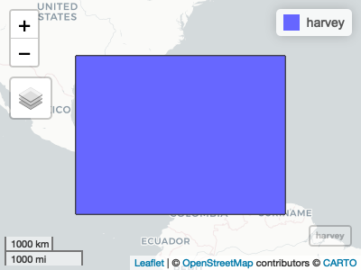
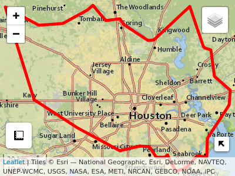
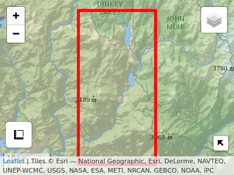

<!-- README.md is generated from README.Rmd. Please edit that file -->

# AOI 

[](https://travis-ci.org/mikejohnson51/AOI)
[](https://coveralls.io/r/mikejohnson51/AOI?branch=master)
[](https://www.repostatus.org/#active)
[](https://zenodo.org/badge/latestdoi/139353238)

The purpose of AOI is to help people create reproducible, programmatic,
boundaries for analysis and mapping workflows. The package targets five
main use cases:

### 1\. Basic forward (place name to lat/long) and reverse (lat/long to place name) geocoding tasks

#### \> Foward (from name/description to location)

``` r
geocode('UCSB', pt = TRUE) %>% aoi_map(returnMap = TRUE)
```


``` r
geocode(event = 'I have a dream speech', pt = T) %>% aoi_map(returnMap = TRUE)
```


#### \> Reverse (from location to name/description)

``` r
geocode_rev(c(37,-119))
#>    place_id osm_type osm_id        county      state
#> 1 235215098 relation 396492 Fresno County California
#>                    country                                             bb
#> 1 United States of America -120.9192485,-118.3612791,35.9066756,37.586101
#>                       Match_addr Addr_type PlaceName        City
#> 1 93664, Shaver Lake, California    Postal     93664 Shaver Lake
#>       Subregion     Region Postal CountryCode  lon lat wkid
#> 1 Fresno County California  93664         USA -119  37 4326
```

### 2\. Consistent query calls for world (rnatural earth) and USA (USAboundaries) boundaries:

#### \> Working with USA state and county information:

``` r
aoi_get(state = "CA") %>% aoi_map(returnMap = T)
```



``` r
aoi_get(state = "TX", county = "Harris") %>% aoi_map(returnMap = T)
```



#### \> Working with world boundary data to call country and regional information:

``` r
aoi_get(country = "Sri Lanka") %>% aoi_map(returnMap = T)
```


``` r

aoi_get(country = "South Asia") %>% aoi_map(returnMap = T)
```



### 3\. Creating flexible AOIs from place names and bounding box dimensions.

#### \> Create your own bounding areas from a list of inputs:

``` r
# 100 square mile region around UCSB
aoi_get(list("UCSB", 10, 10)) %>% aoi_map(returnMap = T)
```


``` r

# 200 square mile region around 37,-119
aoi_get(list(37,-119, 20, 10)) %>% aoi_map(returnMap = T)
```


### 4\. Offer a programmatic way to interface with large web-based datasets (e.g TREDDS/OPeNDAP)

See [climateR](https://github.com/mikejohnson51/climateR) for example

### 5\. Facilitate iterative analysis in an era of big geospatial data

### 6\. Enhance reproducible in spatial analysis.

The package also includes functions to faciliate basic tasks in AOI work
flows such as unioning, buffering, and converting between numeric and
spatial representations. The package builds on the sf package and in
cases of overlap, only offers wrappers for common workflows. By nature
these wrappers save users lines of code and repetition but are less
flexible then there base sf functions.

### Installation:

``` r
remotes::install_github("mikejohnson51/AOI")
```

### Resources

See the package [website](https://mikejohnson51.github.io/AOI/)
vignettes showing the general workflow and functionality of AOI

### Contributing:

Thank you for considering a contribution\!

1)  Contributions should be thoroughly tested with
    [testthat](https://testthat.r-lib.org/).  
2)  Code style should attempt to follow the [tidyverse style
    guide.](http://style.tidyverse.org/)  
3)  Please attempt to describe what you want to do prior to contributing
    by submitting an issue.  
4)  Please follow the typical github [fork - pull-request
    workflow.](https://gist.github.com/Chaser324/ce0505fbed06b947d962)  
5)  Make sure you use roxygen and run Check before contributing.

Other notes: - consider running `lintr` prior to contributing. -
consider running `goodpractice::gp()` on the package before
contributing. - consider running `devtools::spell_check()` if you wrote
documentation.

### Support:

The “AOI” R package is supported with funds from the [UCAR COMET
program](http://www.comet.ucar.edu); the [NOAA National Water
Center](http://water.noaa.gov); and the NSF Convergence Accelerator
Project.
