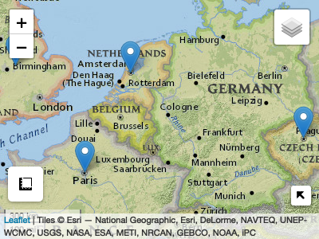

<!-- README.md is generated from README.Rmd. Please edit that file -->

# AOI 

<!-- badges: start -->

[](https://zenodo.org/badge/latestdoi/158620263)
[](https://github.com/mikejohnson51/AOI/actions/workflows/R-CMD-check.yaml)
[](#)
[](https://choosealicense.com/licenses/mit/)
[](https://codecov.io/github/mikejohnson51/AOI)
<!-- badges: end -->

AOI helps create reproducible, programmatic boundaries for analysis and
mapping workflows. The package targets five main use cases:

## 1. Term based geocoding

AOI uses `tidygeocoder` as a backend for term-based geooding and
Wikipedia APIs. If you have more ridgid addresses `tidygeocoder` is
great!

### Foward (from name to location)

#### Places

``` r
geocode(c('Colorado State University', "University of Colorado", 'NOAA'))
#> # A tibble: 3 × 5
#>   request                   score arcgis_address                 x     y
#> * <chr>                     <int> <chr>                      <dbl> <dbl>
#> 1 Colorado State University   100 Colorado State University -105.   40.6
#> 2 University of Colorado      100 University of Colorado    -105.   40.0
#> 3 NOAA                        100 Noaa                       -94.8  29.3
```

#### Addresses

``` r
# Address with POINT representation
geocode('500 Linden St, Fort Collins, CO 80524', pt = TRUE) 
#> Simple feature collection with 1 feature and 5 fields
#> Geometry type: POINT
#> Dimension:     XY
#> Bounding box:  xmin: -105.0665 ymin: 40.59362 xmax: -105.0665 ymax: 40.59362
#> Geodetic CRS:  WGS 84
#> # A tibble: 1 × 6
#>   request             score arcgis_address             geometry     x     y
#>   <chr>               <int> <chr>                   <POINT [°]> <dbl> <dbl>
#> 1 500 Linden St, For…   100 500 Linden St… (-105.0665 40.59362) -105.  40.6
```

#### Events

``` r
# Single events
geocode(event = 'D-day')
#> Simple feature collection with 1 feature and 2 fields
#> Geometry type: POINT
#> Dimension:     XY
#> Bounding box:  xmin: -0.6 ymin: 49.34 xmax: -0.6 ymax: 49.34
#> Geodetic CRS:  WGS 84
#>        request             title           geometry
#> 252854   D-day Normandy landings POINT (-0.6 49.34)

# Multi-location events with BBOX
(harvey = geocode(event = 'Hurricane Harvey', bb = TRUE))
#> Simple feature collection with 9 features and 5 fields
#> Geometry type: POLYGON
#> Dimension:     XY
#> Bounding box:  xmin: -96.81531 ymin: 3.931777 xmax: -56.01361 ymax: 32.83577
#> Geodetic CRS:  WGS 84
#>            request
#> 1 Hurricane+Harvey
#> 2 Hurricane+Harvey
#> 3 Hurricane+Harvey
#> 4 Hurricane+Harvey
#> 5 Hurricane+Harvey
#> 6 Hurricane+Harvey
#> 7 Hurricane+Harvey
#> 8 Hurricane+Harvey
#> 9 Hurricane+Harvey
#>                                                                   all
#> 1                                                    Windward Islands
#> 2                                                            Suriname
#> 3                                                              Guyana
#> 4                                                           Nicaragua
#> 5                                                            Honduras
#> 6                                                              Belize
#> 7                                                      Cayman Islands
#> 8                                                   Yucatán Peninsula
#> 9 Southern and Eastern United States (especially Texas and Louisiana)
#>                                                             request.1  score
#> 1                                                    Windward Islands 100.00
#> 2                                                            Suriname 100.00
#> 3                                                              Guyana 100.00
#> 4                                                           Nicaragua 100.00
#> 5                                                            Honduras 100.00
#> 6                                                              Belize 100.00
#> 7                                                      Cayman Islands 100.00
#> 8                                                   Yucatán Peninsula 100.00
#> 9 Southern and Eastern United States (especially Texas and Louisiana)  93.73
#>                                     arcgis_address
#> 1                                 Windward Islands
#> 2                                         Suriname
#> 3                                           Guyana
#> 4                                        Nicaragua
#> 5                                         Honduras
#> 6                                           Belize
#> 7                                   Cayman Islands
#> 8                                Yucatan Peninsula
#> 9 Southern Ave & Eastern Ave, Dallas, Texas, 75209
#>                         geometry
#> 1 POLYGON ((-96.81531 3.93177...
#> 2 POLYGON ((-96.81531 3.93177...
#> 3 POLYGON ((-96.81531 3.93177...
#> 4 POLYGON ((-96.81531 3.93177...
#> 5 POLYGON ((-96.81531 3.93177...
#> 6 POLYGON ((-96.81531 3.93177...
#> 7 POLYGON ((-96.81531 3.93177...
#> 8 POLYGON ((-96.81531 3.93177...
#> 9 POLYGON ((-96.81531 3.93177...

mapview::mapview(harvey)
```


### Reverse (from location to term)

``` r
geocode_rev(c(37, -119))
#> # A tibble: 1 × 3
#>   address x     y    
#>   <chr>   <lgl> <lgl>
#> 1 <NA>    NA    NA
```

### 2. Consistent queries for domestic (USA) and international boundaries:

#### State / Multi-state

``` r
aoi_get(state = c("CO", "UT"))
#> Simple feature collection with 2 features and 14 fields
#> Geometry type: MULTIPOLYGON
#> Dimension:     XY
#> Bounding box:  xmin: -114.0529 ymin: 36.99246 xmax: -102.0415 ymax: 42.0017
#> Geodetic CRS:  WGS 84
#>   state_region state_division feature_code state_name state_abbr     name
#> 1            4              8      1779779   Colorado         CO Colorado
#> 2            4              8      1455989       Utah         UT     Utah
#>   fip_class tiger_class combined_area_code metropolitan_area_code
#> 1      <NA>       G4000                 NA                   <NA>
#> 2      <NA>       G4000                 NA                   <NA>
#>   functional_status    land_area water_area fip_code
#> 1                 A 268418796417 1185716938       08
#> 2                 A 213355072799 6529973239       49
#>                         geometry
#> 1 MULTIPOLYGON (((-105.155 36...
#> 2 MULTIPOLYGON (((-111.5078 4...
```

#### USA Counties

``` r
aoi_get(state = "TX", county = "Harris")
#> Simple feature collection with 1 feature and 14 fields
#> Geometry type: MULTIPOLYGON
#> Dimension:     XY
#> Bounding box:  xmin: -95.96073 ymin: 29.49734 xmax: -94.90865 ymax: 30.17061
#> Geodetic CRS:  WGS 84
#>   state_region state_division feature_code state_name state_abbr   name
#> 1            3              7      1383886      Texas         TX Harris
#>   fip_class tiger_class combined_area_code metropolitan_area_code
#> 1        H1       G4020                288                   <NA>
#>   functional_status  land_area water_area fip_code
#> 1                 A 4421068052  182379558    48201
#>                         geometry
#> 1 MULTIPOLYGON (((-95.21642 2...
```

#### World Countries

``` r
aoi_get(country = "Ukraine")
#> Simple feature collection with 1 feature and 168 fields
#> Geometry type: MULTIPOLYGON
#> Dimension:     XY
#> Bounding box:  xmin: 22.08561 ymin: 45.29331 xmax: 40.08079 ymax: 52.33507
#> Geodetic CRS:  WGS 84
#>          featurecla scalerank labelrank sovereignt sov_a3 adm0_dif level
#> 113 Admin-0 country         1         3    Ukraine    UKR        0     2
#>                  type tlc   admin adm0_a3 geou_dif geounit gu_a3 su_dif subunit
#> 113 Sovereign country   1 Ukraine     UKR        0 Ukraine   UKR      0 Ukraine
#>     su_a3 brk_diff    name name_long brk_a3 brk_name brk_group abbrev postal
#> 113   UKR        0 Ukraine   Ukraine    UKR  Ukraine      <NA>   Ukr.     UA
#>     formal_en formal_fr name_ciawf note_adm0 note_brk name_sort name_alt
#> 113   Ukraine      <NA>    Ukraine      <NA>     <NA>   Ukraine     <NA>
#>     mapcolor7 mapcolor8 mapcolor9 mapcolor13  pop_est pop_rank pop_year gdp_md
#> 113         5         1         6          3 44385155       15     2019 153781
#>     gdp_year              economy             income_grp fips_10 iso_a2
#> 113     2019 6. Developing region 4. Lower middle income      UP     UA
#>     iso_a2_eh iso_a3 iso_a3_eh iso_n3 iso_n3_eh un_a3 wb_a2 wb_a3   woe_id
#> 113        UA    UKR       UKR    804       804   804    UA   UKR 23424976
#>     woe_id_eh                   woe_note adm0_iso adm0_diff adm0_tlc adm0_a3_us
#> 113  23424976 Exact WOE match as country      UKR      <NA>      UKR        UKR
#>     adm0_a3_fr adm0_a3_ru adm0_a3_es adm0_a3_cn adm0_a3_tw adm0_a3_in
#> 113        UKR        UKR        UKR        UKR        UKR        UKR
#>     adm0_a3_np adm0_a3_pk adm0_a3_de adm0_a3_gb adm0_a3_br adm0_a3_il
#> 113        UKR        UKR        UKR        UKR        UKR        UKR
#>     adm0_a3_ps adm0_a3_sa adm0_a3_eg adm0_a3_ma adm0_a3_pt adm0_a3_ar
#> 113        UKR        UKR        UKR        UKR        UKR        UKR
#>     adm0_a3_jp adm0_a3_ko adm0_a3_vn adm0_a3_tr adm0_a3_id adm0_a3_pl
#> 113        UKR        UKR        UKR        UKR        UKR        UKR
#>     adm0_a3_gr adm0_a3_it adm0_a3_nl adm0_a3_se adm0_a3_bd adm0_a3_ua
#> 113        UKR        UKR        UKR        UKR        UKR        UKR
#>     adm0_a3_un adm0_a3_wb continent region_un      subregion
#> 113        -99        -99    Europe    Europe Eastern Europe
#>                 region_wb name_len long_len abbrev_len tiny homepart min_zoom
#> 113 Europe & Central Asia        7        7          4  -99        1        0
#>     min_label max_label  label_x  label_y      ne_id wikidataid  name_ar
#> 113       2.7         7 32.14086 49.72474 1159321345       Q212 أوكرانيا
#>     name_bn name_de name_en name_es name_fa name_fr  name_el  name_he name_hi
#> 113  ইউক্রেন Ukraine Ukraine Ucrania اوکراین Ukraine Ουκρανία אוקראינה    युक्रेन
#>     name_hu name_id name_it    name_ja    name_ko  name_nl name_pl name_pt
#> 113 Ukrajna Ukraina Ucraina ウクライナ 우크라이나 Oekraïne Ukraina Ucrânia
#>     name_ru name_sv name_tr name_uk name_ur name_vi name_zh name_zht
#> 113 Украина Ukraina Ukrayna Україна  یوکرین Ukraina  乌克兰   烏克蘭
#>          fclass_iso tlc_diff      fclass_tlc fclass_us fclass_fr fclass_ru
#> 113 Admin-0 country     <NA> Admin-0 country      <NA>      <NA>      <NA>
#>     fclass_es fclass_cn fclass_tw fclass_in fclass_np fclass_pk fclass_de
#> 113      <NA>      <NA>      <NA>      <NA>      <NA>      <NA>      <NA>
#>     fclass_gb fclass_br fclass_il fclass_ps fclass_sa fclass_eg fclass_ma
#> 113      <NA>      <NA>      <NA>      <NA>      <NA>      <NA>      <NA>
#>     fclass_pt fclass_ar fclass_jp fclass_ko fclass_vn fclass_tr fclass_id
#> 113      <NA>      <NA>      <NA>      <NA>      <NA>      <NA>      <NA>
#>     fclass_pl fclass_gr fclass_it fclass_nl fclass_se fclass_bd fclass_ua
#> 113      <NA>      <NA>      <NA>      <NA>      <NA>      <NA>      <NA>
#>                           geometry
#> 113 MULTIPOLYGON (((31.78599 52...
```

#### USA and World Regions

``` r
World_asia = aoi_get(country = "Asia")
aoi_describe(World_asia)
#> type:         POLYGON (47)
#> BBox Area:    101752122 [km^2]
#> Centroid:     85.79324 22.51263 [x,y]
#> Diminsions:   7617.139 4536.421 [width, height, in miles]
#> area:         31270884 [km^2]
#> Area/BBox Area:   30.73241 [%]


USA_south = aoi_get(state = "south")
aoi_describe(USA_south)
#> type:         POLYGON (16)
#> BBox Area:    5360056 [km^2]
#> Centroid:     -90.81484 32.51755 [x,y]
#> Diminsions:   1842.137 1120.732 [width, height, in miles]
#> area:         2399422 [km^2]
#> Area/BBox Area:   44.76487 [%]
```

### 3. Creating flexible AOIs from locations and bounding dimensions.

#### Place Name and diminsions

``` r
# 100 square mile region around Longs Peaks
aoi_ext("Long Peaks", wh = 10)
#>      xmin      ymin      xmax      ymax 
#> 33.852795  3.789964 33.852975  3.790145
```

#### Location and Diminsions

``` r
# 200 square mile region around 37,-119
aoi_ext(xy = c(x = 119, y = 37), wh =  c(20, 10))
#>      xmin      ymin      xmax      ymax 
#> 119.00111  37.00024 119.00156  37.00042
```

#### Event and Diminsions

``` r
# 10,000 square meter region around Normandy Landings
aoi_ext(geo = "white house", wh = 10000, bbox = TRUE) |> 
  st_as_sf() |>
  aoi_map(returnMap = T)
```


### 4. View and Draw

**NOTE**: The following functions require leaflet, shiny and
leaflelt.extras. Since these are Suggested Dependencies you will need to
install them yourself in warnings appear.

Sometimes it is useful to view the created AOIs. `aoi_map` offers a
quickly formatted `leaflet` map (not all that dissimilar from `mapview`
so this may retire).

``` r
AOI = geocode(geo = c("Paris", "Amsterdam", "Prague", "England"), pt = TRUE) 
aoi_map(AOI, returnMap = TRUE)
```



Alternatively sometimes users need very specific AOIs that are not
POINTs, bounding boxes, or fiat boundaries. For this AOI provides
`aoi_draw()` which allows users to interactively draw an Area of
Interest (AOI) using a shiny app. Once an object is drawn and the “Save
AOI” button pressed, a new `sf` object called ‘aoi’ will appear in your
environment.

``` r
aoi_draw()
```

<div class="figure">


<p class="caption">
Using the aoi_draw() interface
</p>

</div>

### 5. Programmatic way to interface with other R packages that require user defined AOIs or bounding boxes

The need for AOI’s is rampant in the r-spatial community. AOI plays
nicely with the following non-exhaustive list helping users be to the
meat of their utilities without getting hung up on boundary definition.

| package       |
|---------------|
| ggmap         |
| nhdplusTools  |
| elevatr       |
| terrainr      |
| climateR      |
| dataRetrivial |
| soilDB        |
| nwmTools      |
| FedData       |
| hereR         |

Please add more!

### Installation:

``` r
remotes::install_github("mikejohnson51/AOI")
```

### Support:

AOI has been supported with funds from the [UCAR COMET
program](http://www.comet.ucar.edu) (2018-2019) and the [NSF Convergence
Accelerator
Project](https://nsf.gov/awardsearch/showAward?AWD_ID=1937099&HistoricalAwards=false)
(2020).
