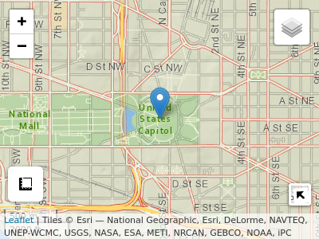
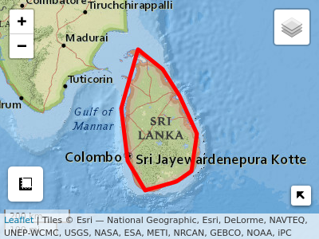
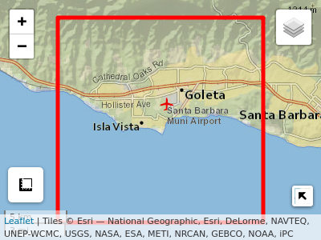

<!-- README.md is generated from README.Rmd. Please edit that file -->

# AOI 

<!-- badges: start -->

[](https://zenodo.org/badge/latestdoi/158620263)
[](https://github.com/mikejohnson51/AOI/actions/workflows/R-CMD-check.yaml)
[](#)
[](https://choosealicense.com/licenses/mit/)
[](https://www.repostatus.org/#active)
[](https://lifecycle.r-lib.org/articles/stages.html#stable)
<!-- badges: end -->

The purpose of AOI is to help people create reproducible, programmatic,
boundaries for analysis and mapping workflows. The package targets five
main use cases:

### 1. Basic forward and reverse geocoding tasks

#### Foward (from name to location)

``` r
geocode('UCSB', pt = TRUE) %>% aoi_map(returnMap = TRUE)
```


``` r
geocode(event = 'I have a dream speech', pt = T) %>% aoi_map(returnMap = TRUE)
```


``` r
geocode(event = 'Inauguration of Joe Biden', pt = T) %>%
  aoi_map(returnMap = TRUE)
```



#### Reverse (from location to name/description)

``` r
geocode_rev(c(37, -119))
```

### 2. Consistent queries for world (`rnaturalearth`) and USA (`USAboundaries`) boundaries:

#### Working with USA state and county information:

``` r
aoi_get(state = "CA") %>% aoi_map(returnMap = T)
```


``` r
aoi_get(state = "TX", county = "Harris") %>% aoi_map(returnMap = T)
```


``` r
aoi_get(country = "Sri Lanka") %>% aoi_map(returnMap = T)
```



### 3. Creating flexible AOIs from place names and bounding box dimensions.

#### Create your own bounding areas from a list of inputs:

``` r
# 100 square mile region around UCSB
aoi_get(list("UCSB", 10, 10)) %>% aoi_map(returnMap = T)
```



``` r
# 200 square mile region around 37,-119
aoi_get(list(37, -119, 20, 10)) %>% aoi_map(returnMap = T)
```


### 4. Offer a programmatic way to interface with other R packages that require user defined AOIs or bounding boxes

-   ggmap
-   nhdplusTools
-   elevatr
-   terrainr
-   climateR
-   dataRetrivial
-   soilDB
-   nwmTools
-   osmdata
-   FedData
-   hereR
-   Please add more!

### 5. Enhance reproducible in spatial analysis.

The package also includes functions to faciliate basic tasks in AOI work
flows such as unioning, buffering, and converting between coordinate and
spatial representations. The package builds on the sf package and in
cases of overlap, only offers wrappers for common workflows. By nature
these wrappers save users lines of code and repetition but are less
flexible then there base sf functions.

### Installation:

``` r
remotes::install_github("mikejohnson51/AOI")
```

### Resources

See the package [website](https://mikejohnson51.github.io/AOI/)
vignettes showing the general workflow and functionality.

### Contributing:

Thank you for considering a contribution!

1.  Contributions should be thoroughly tested with
    [testthat](https://testthat.r-lib.org/).  
2.  Code style should attempt to follow the [tidyverse style
    guide.](http://style.tidyverse.org/)  
3.  Please attempt to describe what you want to do prior to contributing
    by submitting an issue.  
4.  Please follow the typical github [fork - pull-request
    workflow.](https://gist.github.com/Chaser324/ce0505fbed06b947d962)  
5.  Make sure you use roxygen and run Check before contributing.

Other notes: - consider running `lintr` prior to contributing. -
consider running `goodpractice::gp()` on the package before
contributing. - consider running `devtools::spell_check()` if you wrote
documentation.

### Support:

AOI has been supported with funds from the [UCAR COMET
program](http://www.comet.ucar.edu) (2018-2019) and the [NSF Convergence
Accelerator
Project](https://nsf.gov/awardsearch/showAward?AWD_ID=1937099&HistoricalAwards=false)
(2020).
