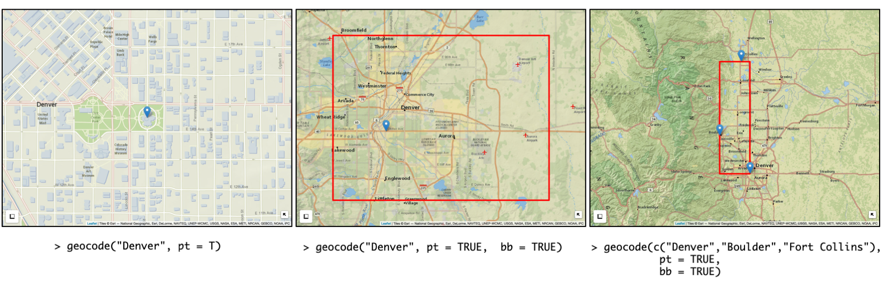
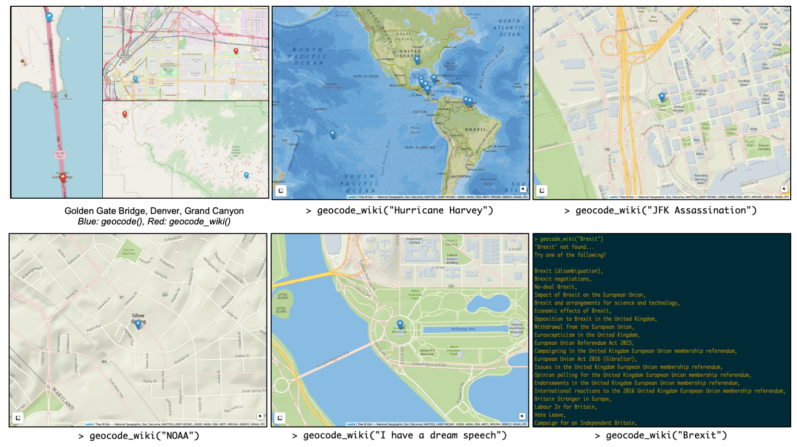
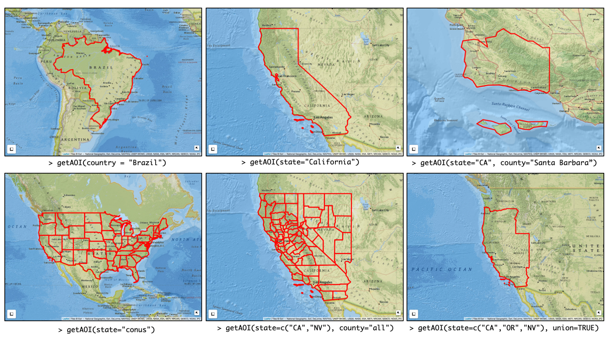
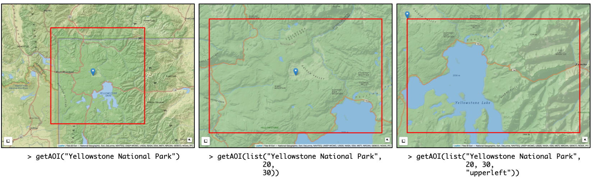
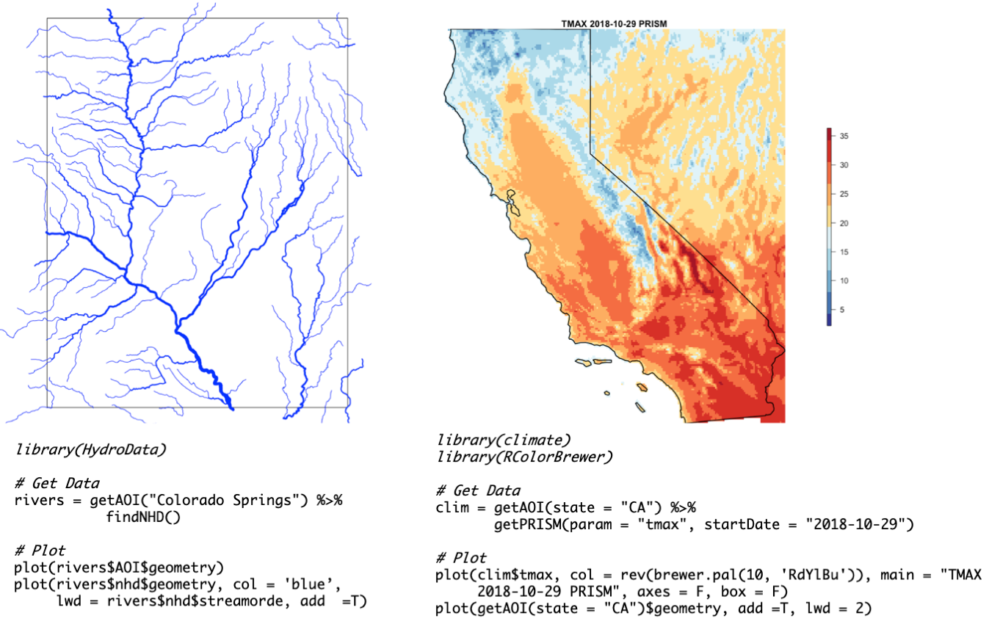

# Summary

The primary functions in this package are `geocode`/`geocode_rev`, `aoi_get`, `aoi_map`/`aoi_draw`.  The first returns a `data.frame` of coordinates from place names using the Open Street Map API; the second returns a list of descriptive features from a known place name or latitude longitude pair; the third returns a simple features (sf) geometry from a country, state, county, or defined region, and the last an extent encompassing a set of input features. Additional helper functions include `bbox_st` and `bbox_sp` which help convert AOIs between string and geometries;  `check` which helps users visualize AOIs in an interactive leaflet map; `modify` which allows AOIs to be modified by uniform distances; and `is_inside` which check for partial and complete overlap over features.  Finally, `describe`  breaks existing spatial features into `getAOI` parameters to improve the reproducibility of geometry generation. Three core datasets are served with the package. The first contains the spatial geometries and identification attributes of all `world` countries. The second, the spatial geometries for US `states` and the third contains the same for all US `counties`.

# Introduction

An Area of Interest (AOI) is a geographic extent demarcating a region of the earth with significance to an analysis or user. AOIs can be complex geometries, such as a state outlines or watershed boundaries, or simply, a bounding box defined by minimum and maximum X,Y coordinates.  In spatial data science, where data is often continuous (eg raster climate and satellite data), or at least more expansive than needed (e.g. national or state scale vector data), AOIs are commonly used for limiting the scope of a study by subsetting existing data to a new, more manageable, extent.

Subsetting tasks can be executed on local data, but are commonly being outsourced to cloud based data repositories via URL queries.  Initially, `AOI` was conceived as a helper package for converting existing spatial representations into bounding coordinates, querying web-based services; and coercing the returned data into standard spatial formats (e.g. `sf` and `SpatRaster` for R).

Over the course of package construction, it became more clear that while the idea of an AOI is quite simple, the practice of generating AOIs in a reproducible, flexible, and programmatic way is quite complicated, and is down in a suprisingly large variety of ways across packages.

To illustrate, while most of us can quickly describe an AOI by the features and dimensions of the area we are interested in (eg  ‘California”,  “UCSB's campus”, or, “the 100 square mile area surrounding Denver, Colorado”) few us can, on the fly, describe these regions by the lat/long vertices needed to generate a polygon, query  any  service,  or populate many existing R function.  As a result, we generally revert to some combination of finding an existing spatial file online, launching Google Earth, drawing a polygon in ArcMap or QGIS, or visiting a geocoding website.  The obvious drawback to these workflows are the time they take, their execution out of an otherwise programmatic workflow, and the inherent lack of reproducibility. As data science - and science as a whole - transitions to more transparent sharing of analysis [@lowndes2017], the ability to quickly, and flexibly  generate AOIs programmatically is, if not critical, quite convenient. In this vein, AOI covers four main themes:

1. Forward, reverse, and event/association based geocoding
2. AOI queries based on fiat boundaries (country, state, county, zipcode)
3. AOI creation from point and bounding box dimensions
4. Wrappers for common AOI processes

The remainder of this paper is structured to discuss, primarily through example, these themes. On a more technical note, AOI plays nicely with the  `terra`[@hijmans2019] [@bivand2008], and `sf`[@pebesma2018] data models but returns all features as `sf` objects in EPSG:4269. The default length measurement in AOI is miles however any function requiring a distance input  has a `km` parameter that can be set to `TRUE`. Finally, all functions are designed to work with tidy [@tidyverse2017] and `magrittr` [@magrittr2014] piping principles allowing seamless integration with other dplyr based packages.

# 1. Geocoding

Geocoding is the process of converting descriptions of place to XY coordinates.  The AOI packages offers an API interface to the Open Street Map (OSM) Nominatim [@OpenStreetMap2017] tool which provides search capacities by name and address. While other packages offer geocoding (eg dismo, prettymapper, ggmap, opencage, tidygeocode) each relies on a commercial service  (Google, pickpoint.io, Opencage respectively) that have limitations, user agreements, and/or require API keys. Sticking to the core of the open source and R spatial community, adding a free and open source geocoding engine seemed ideal. Basic AOI geocoding requires a character-sting input and returns a `data.frame` of latitude and longitude coordinates.

```r
> str(geocode("Denver"))
'data.frame':	1 obs. of  2 variables:
 $ lat: num 39.7
 $ lon: num -105
```

If a user wants more information , they can turn on the full return which appends all attribute data from the Nominatim data base to the returned `data.frame`:

```r
> str(geocode("Denver", full = T))
'data.frame':	1 obs. of  10 variables:
 $ place_id    : int 198230466
 $ osm_type    : chr "relation"
 $ osm_id      : int 253750
 $ boundingbox :List of 1
  ..$ : chr  "39.6143154" "39.9142087" "-105.1098845" "-104.5996889"
 $ lat         : num 39.7
 $ lon         : num -105
 $ display_name: chr "Denver, Denver County, Colorado, United States of America"
 $ class       : chr "place"
 $ type        : chr "city"
 $ importance  : num 0.765
```

In addition to attribute data, users can request point and/or bounding box realizations of a query using the `pt` and `bb` parameters respectively (Figure 1A-B). Bounding boxes are derived from the OSM bounding box string (seen the OSM attribute data) and points from the latitude/longitude pair.

The geocode function can iterate over multiple locations providing data.frame, point, and bb objects pending the function parameterization. The only difference in the case of multiple requests is that `bb=TRUE` returns the minimum bounding box of all queried points rather than the bounding area of each query (Figure 1C).



*Figure 1: Figure 1: Geocoding services can provide (A) point and (B) bounding box realizations of a location. Multiple queries can be passed to the geocoding function (C) and the retuned bounding box represents the minimum extent containing all points.*

In some cases, particularly in the social sciences,  the interest in geocoding is discovering where an event occurred or is associated. Events and associations are not embedded in the OSM database as they are ephemeral. As such `AOI` offers a Wikipedia geocoding function that tries to assign XY coordinates to a query based on the metadata contained in the Wikipedia entry. Figure 2A-D shows instances of “Hurricane Harvey”, “JFKs Assassination”, “NOAA”, and “I have a dream speech”. It should be noted that (as expected) there are discrepancies between locations returned by the OSM geocoding service (blue) and the Wikipedia entry (red) (Figure 2E) however they are generally negligible. In instances where a geolocation is not found from the Wikipedia query, a list of alternative queries are supplied from the pages linked to the original query (Figure 2F).



*Figure 2: The `geocode_wiki` function attempts to scape locational information from the associated wikipedia page. Events (A-D) can be queried. It should be noted that the OSM and Wikipedia locations are not exact but are largely the same (E) and when locational information can not be found for a specific query, a list of alternatives derived from linked pages are offered (F). *

In contrast to converting place names to XY coordinates, reverse geocoding converts XY locations to known address and/or place names. While less useful in the contexts of AOI creation, the aim of providing a complete geocoding service within AOI necessitates the inclusion of a reverse geocoding service. AOI provides an interface to the open OSM Nominatim and ESRI APIs [@ESRI2019] and the returned results are the combined returns from these APIs. As an example, we request the attribute data of location c(-37, -120).

```r
> str(revgeocode(c(37,-119)))
List of 19
 $ place_id    : int 352144
 $ osm_type    : chr "node"
 $ osm_id      : int 150949694
 $ lat         : chr "36.9693904"
 $ lon         : chr "-119.0173346"
 $ display_name: chr "Sawmill Flat, Fresno County, California, USA"
 $ hamlet      : chr "Sawmill Flat"
 $ county      : chr "Fresno County"
 $ state       : chr "California"
 $ country     : chr "USA"
 $ bb          : chr "-119.0573346,-118.9773346,36.9293904,37.0093904"
 $ match_addr  : chr "93664, Shaver Lake, California"
 $ longlabel   : chr "93664, Shaver Lake, CA, USA"
 $ shortlabel  : chr "93664"
 $ addr_type   : chr "Postal"
 $ city        : chr "Shaver Lake"
 $ lon         : int -119
 $ lat         : int 37
 $ wkid        : int 4326
 - attr(*, "class")= chr [1:2] "geoloc" "list”*
```

# 2. Fiat boundary queries

Where geocoding converts point-based description to XY space we also need a method for converting descriptive space to XY area representations. One of the mpost common area representations are offical fiat boundaries. While shapefiles of these features certainly exist across the web, their use is not always streamlined and may require the need to download, unzip, import,  and subset files stored in a myriad of formats. To remove some of these steps, `AOI` delivers a set of lightweight datasets that can be queried with the `getAOI()` function. The USA boundaries provided are a simplified version of the USABoundaries [@USAboundaries2018] dataset and country geometries come from Natural Earth. Country geometries are also merged with the CIA World Factbook database providing a rich collection of country level attributes in a central location.


Examples of fiat queries, including some of their variations and parameter choices can be seen in figure 3:



*Figure 3: (A) `getAOI` facilitates queries for (A) countries (B) states (C) and state-county pairs. Variations allow for the extraction of the lower 48 state (D) all counties in a given state set (E) and the option to union all requested objects in to a single unit (F). *

# 3. Flexible bounding box queries

In addition to querying fiat boundaries, `getAOI` allows users to generate unique AOIs through a set of parameters describing a location and bounding box dimensions.  At a minimum, `getAOI` requires a place name from which the OSM boundary is defined, with a result analogous to `geocode(XXX, bb = T)`(Figure 4A). To exert more control over the dimensions of the bounding box, users can specify a height and width (in miles). This bounding box is, by default, drawn treating the input location as the centroid (Figure 4B). Alternatively a user can specify the relative location of the location to the queried bounding box by selecting between “upperleft”, “lowerleft”, “upperright”, “lowerright” and “center” (Figure 4C). Iterations on these calls can include providing a latitude/longitude pair instead of a place name, or setting the units of the bounding box dimensions to kilometers via `km = TRUE`.



*Figure 4: The `getAOI()` function allows users to define unique subsets of space from a number of inputs. At minimum a location name (A). In addition bounding box dimensions (B)  and the relative location of the point to the bounding box *

# 4. Tools for AOI manipulation

Through our own research and discussions with other package users we have found a common set of tasks central to AOI workflows. All of these are possible through other packages such as `sf` and `leaflet`[@leaflet2018] but require a few lines of code to execute. Given the pervasive, and repetitive nature of these tasks, `AOI` offers a number of wrappers to speed up AOI manipulation, they are described as follows.

`is_inside`:  checks if one of the input geometries is completely (or partially) contained within the other. There is no preference given to order of inputs and the return is a binary TRUE/FALSE.

`modify`:  allows users to refine existing extents by adding or subtracting a distance from all edges.  Such an operation is analogous to `sf::st_buffer` with the exception that `modify` takes miles or kilometers as default input units as opposed to units of the projection.

`getBoundingBox`: returns a `sf` bounding box from an input  `sf`, `sp`, or `raster` object in the projection of the input.

Two convenience functions `bbox_st` and `bbox_sp` help convert between `data.frame` and `sf` representations of a bounding area respectively.

`check`: is a leaflet wrapper that generates an interactive map of a queried point or boundary. Embedded in these maps are tools for measuring distance, finding latitude and longitude coordinates, and viewing a variety of base maps. All images in the paper were created by piping the respective getAOI or geocode call to `check()` (e.g. `getAOI("Denver") %>% check()`).

In addition of providing programatic workflows for creating AOIs, one of the principle aims of this package is to enhance reproducibility without needing to read, write, and share files. This is first achieved by allowing AOIs to be generated within scripts. However, there is often a need to verbally describe the AOI used. In cases where the AOI was not created via `getAOI()`, `describe`  converts any spatial object into the AOI parameters needed to replicate the extent.

```r
> r = raster(system.file("external/test.grd", package="raster"))
> str(describe(r))
'data.frame':	1 obs. of  6 variables:
 $ lat   : num 51
 $ lon   : num 5.74
 $ height: num 2.86
 $ width : num 1.99
 $ origin: chr "center"
 $ units : chr "miles"
```
# Conclusion

The initial goal driving this package was the ability to make fast queries to web-based resources. As this goal was pursued it became evident that the need to flexibly define and refine space as concrete objects was not solely a backend issue for package developers but a lynchpin for fast, exploratory, and reproducible spatial data analysis.  This realization shifted the aim of AOI to providing a set of tools for programmatically  generating and manipulating AOIs. The result can help users to more easily populate required information for packages interfacing with spatial databases; utilize spatial boundaries in their own workflows; and replicate work without needing to read, write, and share boundary files.

The aim of supporting web query package has not died and `AOI` supports a number of in-development packages including NWM, HydroData, climateR. Representative functions and workflows from two of these packages can be seen in figure 5. Figure 5A shows a workflow for reading in National Hydrographic Dataset (NHD) river network information for Colorado Springs while 5B shows a work flow for reading in temperature data for California from October 29th, 2019.



*Figure 5: AOI workflows for web-based data retrial packages. (A) HydroData::findNHD() queries all river network data from the USGS National Hydrography Dataset (B) climateR::getPRISM() queries temperature data from the PRISM dataset. Both fuctions require an AOI as input.*

AOI has also proven useful in providing map-based Shiny applications seeking to provide geocoding search functionality, and resulting centering and zoom parameters (Flowfinder). Moreover though, AOI is primed to work with a wide array of existing CRAN packages that require spatial extents as input. These include but are not limited to: *feddata, rosm, elevatr, soilDB, osmdata, raster, geoknife, sharpshooter, ceramic*. Working examples for each of these along with full AOI documentation can be found at [https://mikejohnson51.github.io/AOI].

In the end, the purpose of `AOI` is to expedite common tasks centered around formalizing space. It fits within the existing and evolving R spatial ecosystem, and aims to save users time while increasing speed and reproducibility. We contend it has applications for both package development and spatial workflows, and that its grounding in free and open source services and datasets will give it lasting usability.

# Availability
`AOI` is open source software made available under the MIT license. It can be installed  from its GitHub repository using the `devtools` package: `devtools::install_github("mikejohnson51/AOI")`. Current coverage is handled by Travis CI and coveralls.

# Acknowledgements

The AOI package was developed under the UCAR and National Water Center COMET program (2018/2019).

# References
